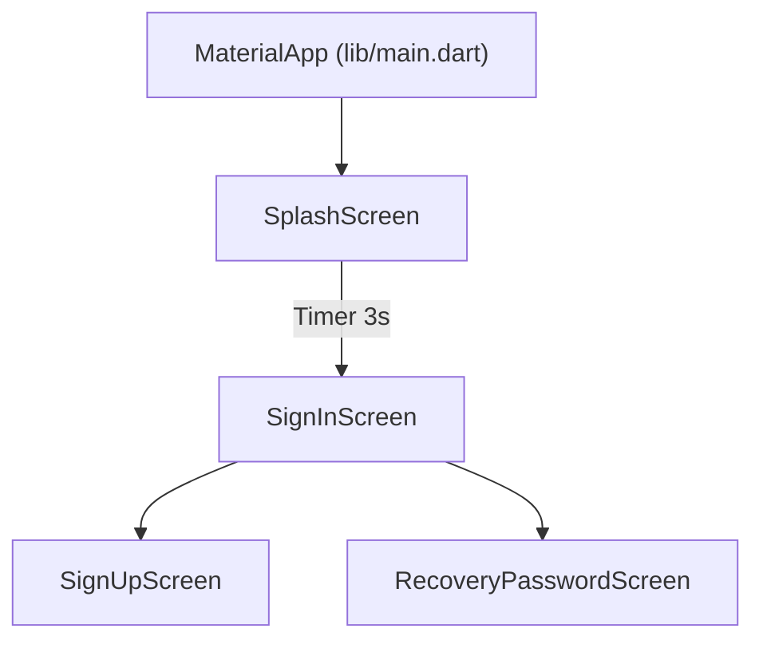
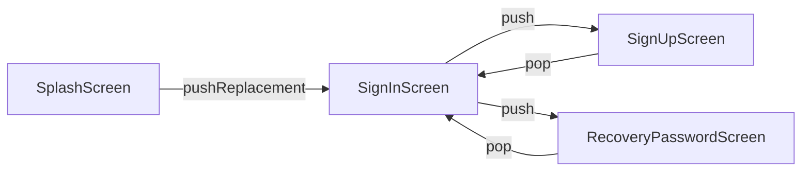

# docs/DIAGRAMS

## Diagrama de Arquitectura (alto nivel)

```mermaid
flowchart TD
  A["MaterialApp (lib/main.dart)"] --> B[SplashScreen]
  B -->|Timer 3s| C[SignInScreen]
  C --> D[SignUpScreen]
  C --> E[RecoveryPasswordScreen]
```

## Diagrama de Navegación (puntos de entrada)

```mermaid
flowchart LR
  S[SplashScreen] -->|pushReplacement| SI[SignInScreen]
  SI -->|push| SU[SignUpScreen]
  SI -->|push| RP[RecoveryPasswordScreen]
  RP -->|pop| SI
  SU -->|pop| SI
```

